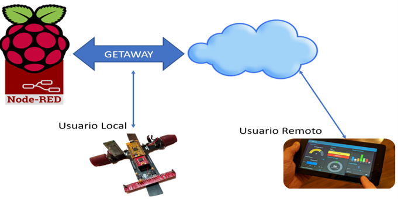
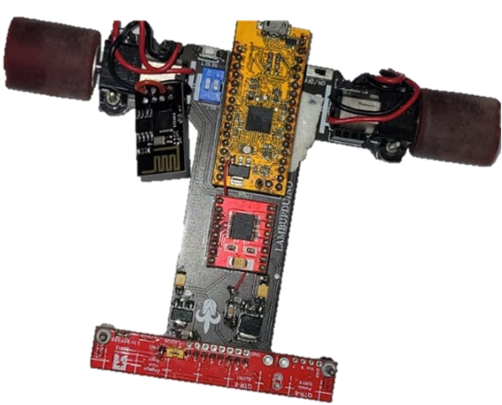
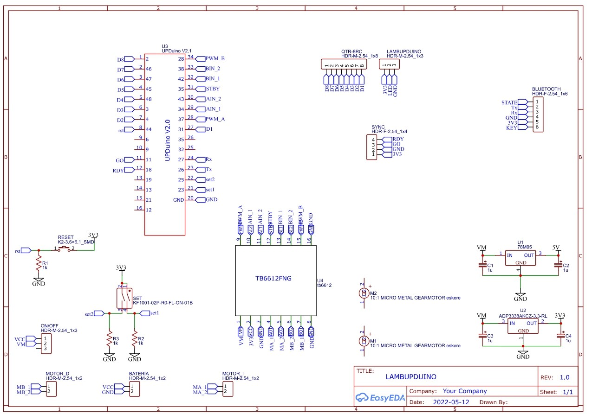
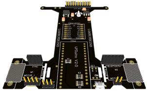
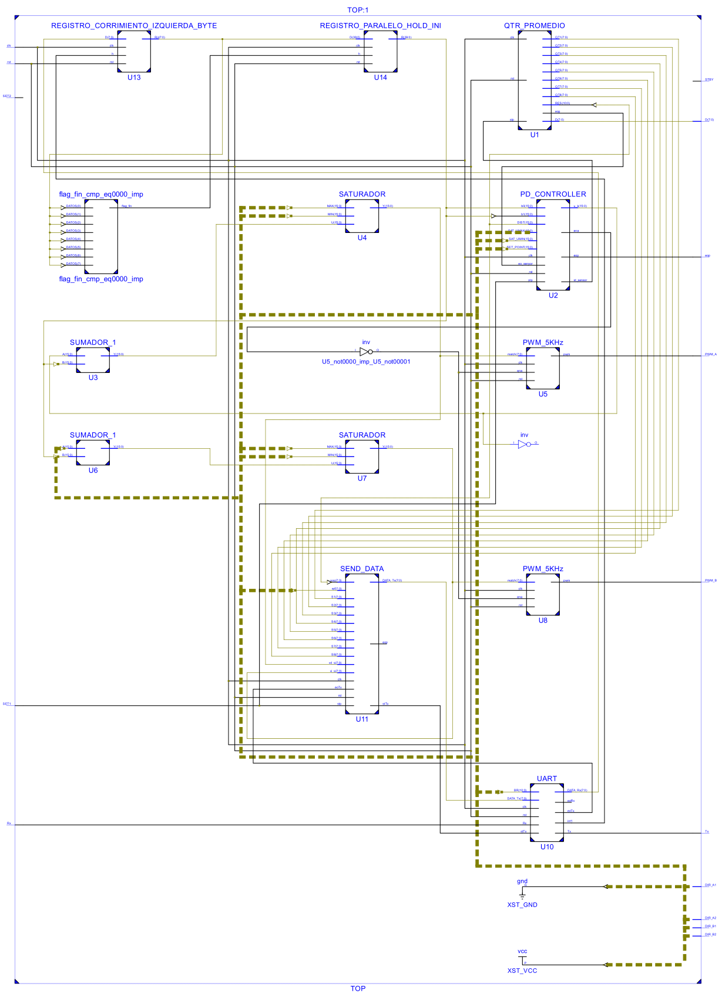
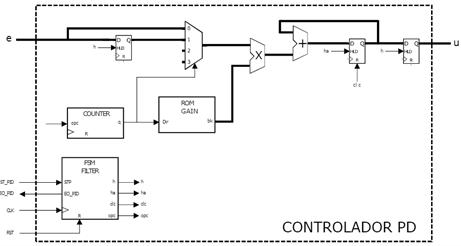
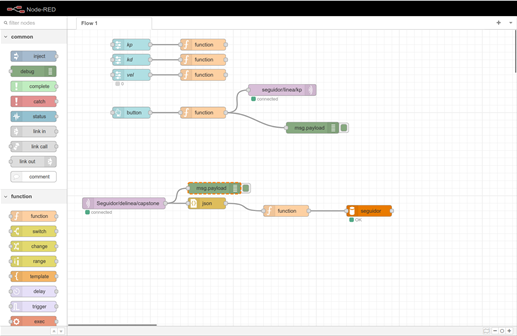
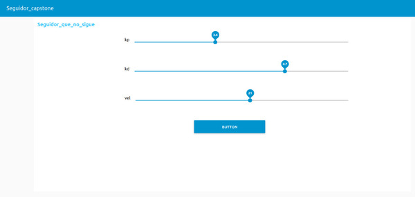
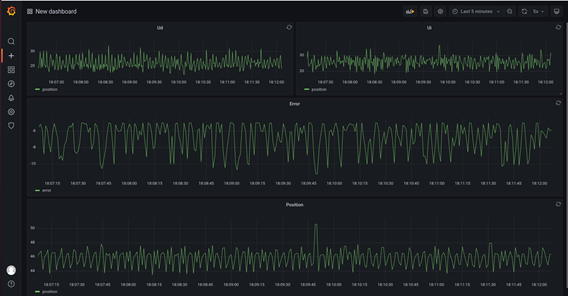

# Monitoreo remoto de variables para optimización de un control de velocidad de un vehículo.

## Universidad Veracruzana                                                                                                                                     
Facultad de Ingeniería en Electronica y Comunicaciones, Región Poza Rica - Tuxpan

## Equipo 18:
* Dr. Miguel Ángel Rojas Hernández
* Dr. Edson Eduardo Cruz Miguel
* Mtro. Omar Alenxander Barra Vázquez

## Resumen

El presente proyecto tiene como finalidad la implementación de un controlador para el seguimiento de trayectorias de un robot seguidor de línea y el monitoreo de variables de cada sensor involucrado para tener el histórico y realizar la toma de decisiones sobre los parámetros del controlador a través del uso del IoT. Para el control del robot se empleo una FPGA open source, para el envío de la información se utilizó un ESP8266 y como servidor se utilizó una Raspberry pi 4.

* En este enlace [youtube video](https://www.youtube.com/watch?v=SAdCPYdH9SM) puedes verlo en accion!

## MATERIALES

* FPGA ICE40UP5K, se utiliza como el cerebro del robot. Aquí, se encuentran implementados los algoritmos de control, los módulos para el correcto funcionamiento de los sensores, así como los algoritmos para procesar la señal. Se implementaros los módulos PWM (Pulse Width Modulation) para la aplicación de la señal de control a los motores. También se implementó el protocolo de comunicación UART (Universal Asyncrhonous Receiver-Transmitter) para establecer la comunicación con el ESP8266.
* ESP8266, se empleo este microcontrolador de bajo consumo, facilidad de conexión inalámbrica y espacio reducido del robot seguidor. La ESP8266 se encarga de recibir las señales desde la FPGA a través del protocolo UART y enviarlas utilizando tecnología WIFI a un servidor implementado en la Raspberry Pi.
* Sensor QTR-8RC, son un conjunto de sensores de reflectancia ampliamente utilizado como sensor de línea. Este módulo contiene ocho pares de emisor y receptor de IR (fototransistor) espaciados uniformemente a intervalos de 0,375" (9,525 mm). Para usar un sensor, primero debe cargar el nodo de salida aplicando un voltaje a su pin de SALIDA. Luego puede leer la reflectancia retirando ese voltaje aplicado externamente en el pin de SALIDA y cronometrando el tiempo que tarda el voltaje de salida en decaer debido al fototransistor integrado. Un tiempo de decaimiento más corto es una indicación de una mayor reflexión. Algunas de las ventajas de emplear este sensor son que no se requiere un convertidor de analógico a digital, la lectura paralela.
* TB6612, el controlador de motor TB6612FNG puede controlar hasta dos motores de CC a una corriente constante de 1.2A (pico de 3.2A). Acepta señales de PWM de hasta 100kHz. Los pines de control aceptan voltajes mínimos de 2.7V y máximo de 5.5V. Tiene diodos de protección internos por lo que no es necesario implementarlos externamente.
* Micromotor pololu 10:1, este motorreductor es un motor de CC con escobillas de 6 V de alta potencia en miniatura con una caja de engranajes de metal de 9.96:1. Tiene una sección transversal de 10 × 12 mm y el eje de salida tiene 9 mm de largo y 3 mm de diámetro.
* Llantas para Seguidor de linea de alto desempeño, se muestran en Figura 9. Estas llantas están diseñadas para tener una máxima adherencia,  lo que las hace perfectas para competencias de robótica. Tienen un peso de 18 gramos por llanta y 2 cm de diámetro, rin de aluminio, con orificio de tornillo para sujetarlo al motor compatible con motores Pololu con eje de 3mm.

## Diseño de la PCB

## Implementación en FPGA

$u[nTs] = (k_p + \frac{k_d}{Ts}) e[nT_s] + \frac{k_d}{Ts} e[nT_s - Ts]$

## Implementación en ESP8266

## Desarrollo en Node-Red

## Grafana

